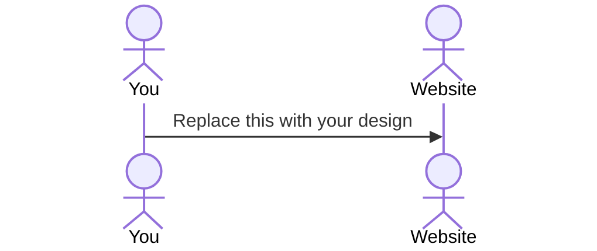

# My Bookshelf

[My Notes](notes.md)

My Bookshelf is a website where users can enter books they read, and the books will be displayed on a bookshelf.

## 🚀 Specification Deliverable

For this deliverable I did the following. I checked the box `[x]` and added a description for things I completed.

- [ ] Proper use of Markdown
- [x] A concise and compelling elevator pitch
- [x] Description of key features
- [ ] Description of how you will use each technology
- [ ] One or more rough sketches of your application. Images must be embedded in this file using Markdown image references.

### Elevator pitch

My Bookshelf allows users to track the books they read by putting them on a beautiful bookshelf! They can customize the appearance and placement of the books. Readers can rate and write reviews for each book, then share their ratings with other readers.

### Design

Lorem ipsum dolor sit amet, consectetur adipiscing elit, sed do eiusmod tempor incididunt ut labore et dolore magna aliqua. Ut enim ad minim veniam, quis nostrud exercitation ullamco laboris nisi ut aliquip ex ea commodo consequat. Duis aute irure dolor in reprehenderit in voluptate velit esse cillum dolore eu fugiat nulla pariatur. Excepteur sint occaecat cupidatat non proident, sunt in culpa qui officia deserunt mollit anim id est laborum.

### Key features

- Secure login over HTTPS
- Add books to the bookshelf
- Customize the color, width, and height of the book
- Change placement of books on the shelf
- Click on the book to see your rating and review
- Send notification with title and rating to other users when you add a book
- Displays a book quote

### Technologies

I am going to use the required technologies in the following ways.

- **HTML** - Uses correct HTML structure for application. Five HTML pages, shown in the Design section of this README.
- **CSS** - Application styling that uses good whitespace, color choice and contrast. Creates the appearance of the bookshelf.
- **React** - Provides login, allows interactive moving books, and use of React for routing and components.
- **Service** - Call to a third party for a book quote. Backend service with endpoints for:
    - login
    - retrieving books, ratings, and reviews
    - submitting books, ratings, and reviews
- **DB/Login** - Store users, book info, ratings, and reviews. Register and login users. Credentials securely stored in database. Can't add or move books unless authenticated.
- **WebSocket** - As each user adds books, the title and rating are given to all other users.

## 🚀 AWS deliverable

For this deliverable I did the following. I checked the box `[x]` and added a description for things I completed.

- [ ] **Server deployed and accessible with custom domain name** - [My server link](https://yourdomainnamehere.click).

## 🚀 HTML deliverable

For this deliverable I did the following. I checked the box `[x]` and added a description for things I completed.

- [ ] **HTML pages** - I did not complete this part of the deliverable.
- [ ] **Proper HTML element usage** - I did not complete this part of the deliverable.
- [ ] **Links** - I did not complete this part of the deliverable.
- [ ] **Text** - I did not complete this part of the deliverable.
- [ ] **3rd party API placeholder** - I did not complete this part of the deliverable.
- [ ] **Images** - I did not complete this part of the deliverable.
- [ ] **Login placeholder** - I did not complete this part of the deliverable.
- [ ] **DB data placeholder** - I did not complete this part of the deliverable.
- [ ] **WebSocket placeholder** - I did not complete this part of the deliverable.

## 🚀 CSS deliverable

For this deliverable I did the following. I checked the box `[x]` and added a description for things I completed.

- [ ] **Visually appealing colors and layout. No overflowing elements.** - I did not complete this part of the deliverable.
- [ ] **Use of a CSS framework** - I did not complete this part of the deliverable.
- [ ] **All visual elements styled using CSS** - I did not complete this part of the deliverable.
- [ ] **Responsive to window resizing using flexbox and/or grid display** - I did not complete this part of the deliverable.
- [ ] **Use of a imported font** - I did not complete this part of the deliverable.
- [ ] **Use of different types of selectors including element, class, ID, and pseudo selectors** - I did not complete this part of the deliverable.

## 🚀 React part 1: Routing deliverable

For this deliverable I did the following. I checked the box `[x]` and added a description for things I completed.

- [ ] **Bundled using Vite** - I did not complete this part of the deliverable.
- [ ] **Components** - I did not complete this part of the deliverable.
- [ ] **Router** - I did not complete this part of the deliverable.

## 🚀 React part 2: Reactivity deliverable

For this deliverable I did the following. I checked the box `[x]` and added a description for things I completed.

- [ ] **All functionality implemented or mocked out** - I did not complete this part of the deliverable.
- [ ] **Hooks** - I did not complete this part of the deliverable.

## 🚀 Service deliverable

For this deliverable I did the following. I checked the box `[x]` and added a description for things I completed.

- [ ] **Node.js/Express HTTP service** - I did not complete this part of the deliverable.
- [ ] **Static middleware for frontend** - I did not complete this part of the deliverable.
- [ ] **Calls to third party endpoints** - I did not complete this part of the deliverable.
- [ ] **Backend service endpoints** - I did not complete this part of the deliverable.
- [ ] **Frontend calls service endpoints** - I did not complete this part of the deliverable.
- [ ] **Supports registration, login, logout, and restricted endpoint** - I did not complete this part of the deliverable.

## 🚀 DB deliverable

For this deliverable I did the following. I checked the box `[x]` and added a description for things I completed.

- [ ] **Stores data in MongoDB** - I did not complete this part of the deliverable.
- [ ] **Stores credentials in MongoDB** - I did not complete this part of the deliverable.

## 🚀 WebSocket deliverable

For this deliverable I did the following. I checked the box `[x]` and added a description for things I completed.

- [ ] **Backend listens for WebSocket connection** - I did not complete this part of the deliverable.
- [ ] **Frontend makes WebSocket connection** - I did not complete this part of the deliverable.
- [ ] **Data sent over WebSocket connection** - I did not complete this part of the deliverable.
- [ ] **WebSocket data displayed** - I did not complete this part of the deliverable.
- [ ] **Application is fully functional** - I did not complete this part of the deliverable.
