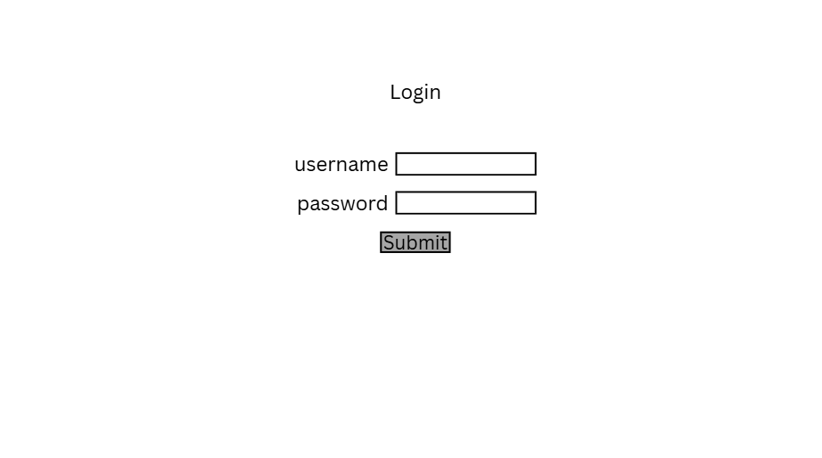
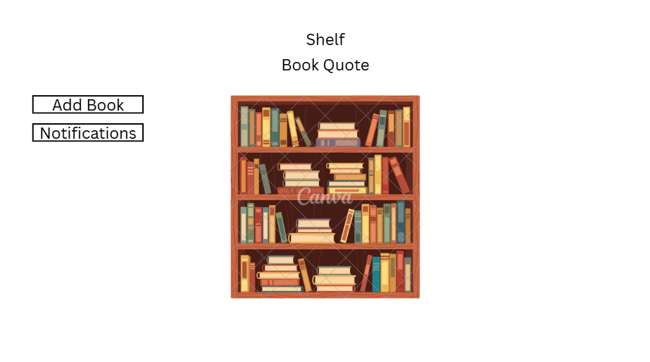
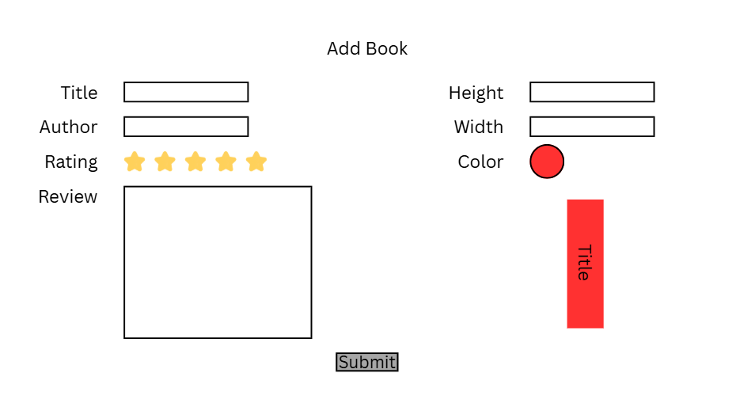
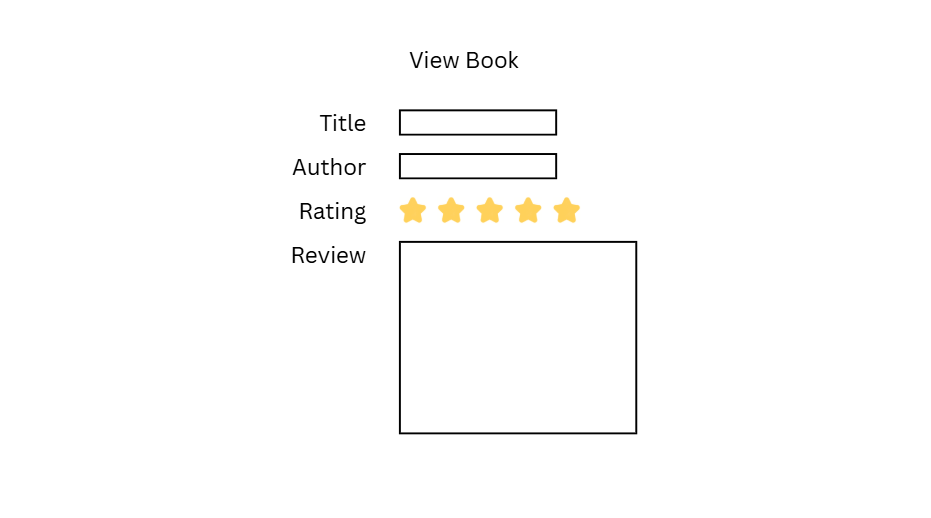
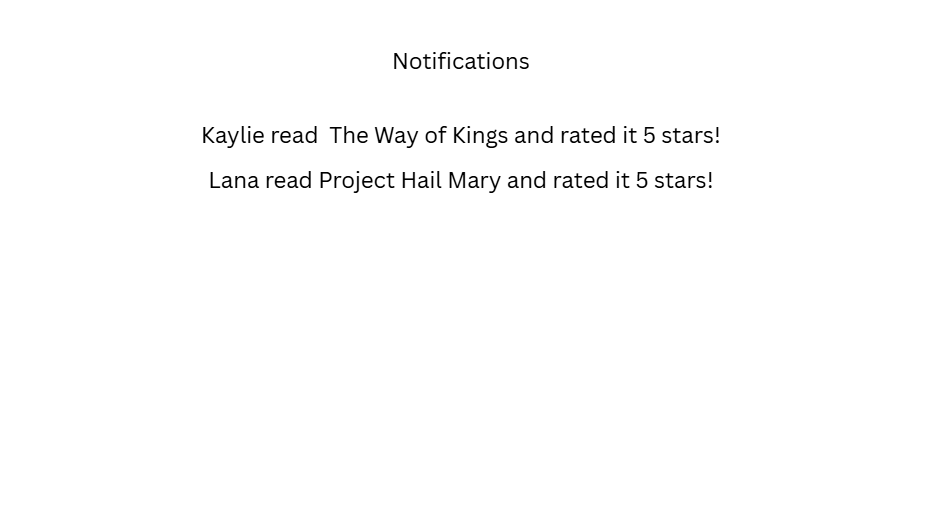

# My Bookshelf

[My Notes](notes.md)

My Bookshelf is a website where users can enter books they read, and the books will be displayed on a bookshelf.

## 🚀 Specification Deliverable

For this deliverable I did the following. I checked the box `[x]` and added a description for things I completed.

- [x] Proper use of Markdown
- [x] A concise and compelling elevator pitch
- [x] Description of key features
- [x] Description of how you will use each technology
- [x] One or more rough sketches of your application. Images must be embedded in this file using Markdown image references.

### Elevator pitch

My Bookshelf allows users to track the books they read by putting them on a beautiful bookshelf! They can customize the appearance and placement of the books. Readers can rate and write reviews for each book, then share their ratings with other readers.

### Design

### Key features

- Secure login over HTTPS
- Add books to the bookshelf
- Customize the color, width, and height of the book
- Change placement of books on the shelf
- Click on the book to see your rating and review
- Send notification with title and rating to other users when you add a book
- Displays a book quote

### Technologies

I am going to use the required technologies in the following ways.

- **HTML** - Uses correct HTML structure for application. Five HTML pages, shown in the Design section of this README.
- **CSS** - Application styling that uses good whitespace, color choice and contrast. Creates the appearance of the bookshelf.
- **React** - Provides login, allows interactive moving books, and use of React for routing and components.
- **Service** - Call to a third party for a book quote. Backend service with endpoints for:
    - login
    - retrieving books, ratings, and reviews
    - submitting books, ratings, and reviews
- **DB/Login** - Store users, book info, ratings, and reviews. Register and login users. Credentials securely stored in database. Can't add or move books unless authenticated.
- **WebSocket** - As each user adds books, the title and rating are given to all other users.

## 🚀 AWS deliverable

For this deliverable I did the following. I checked the box `[x]` and added a description for things I completed.
- [x] **Server deployed and accessible with custom domain name** - [My server link](https://daily-bread.click).

## 🚀 HTML deliverable

For this deliverable I did the following. I checked the box `[x]` and added a description for things I completed.

- [x] **HTML pages** - Five HTML pages that represent the abilities to login, add/view books, see notifications, and view the bookshelf.
- [x] **Proper HTML element usage** - I properly used elements like BODY, NAV, MAIN, HEADER, and FOOTER in each of my HTML files.
- [x] **Links** - The heading on each page includes links to all of the pages. The Bookshelf page links to the View Book page.
- [x] **Text** - There is text displaying the book information like title, author, rating, and review.
- [x] **3rd party API placeholder** - On the Bookshelf page there is a placeholder for a book quote from a 3rd party API.
- [x] **Images** - I included an image of bread in the header on each page.
- [x] **Login placeholder** - There are input boxes and a submit button for login.
- [x] **DB data placeholder** - The book on the shelf and the book information on the View Book page represent data pulled from the database. The submitted book information represents data put into the database.
- [x] **WebSocket placeholder** - The Notifications page will show realtime data about books submitted.

## 🚀 CSS deliverable

For this deliverable I did the following. I checked the box `[x]` and added a description for things I completed.

- [x] **Visually appealing colors and layout. No overflowing elements.** - Colors and layout have good contrast and spacing. Everything is easy to read.
- [x] **Use of a CSS framework** - I used bootstrap CSS.
- [x] **All visual elements styled using CSS** - Yes.
- [x] **Responsive to window resizing using flexbox and/or grid display** - Looks good on different window sizes and devices.
- [x] **Use of a imported font** - I used Montserrat.
- [x] **Use of different types of selectors including element, class, ID, and pseudo selectors** - Used them all. See Login and Bookshelf pages.

## 🚀 React part 1: Routing deliverable

For this deliverable I did the following. I checked the box `[x]` and added a description for things I completed.

- [ ] **Bundled using Vite** - I did not complete this part of the deliverable.
- [ ] **Components** - I did not complete this part of the deliverable.
- [ ] **Router** - I did not complete this part of the deliverable.

## 🚀 React part 2: Reactivity deliverable

For this deliverable I did the following. I checked the box `[x]` and added a description for things I completed.

- [ ] **All functionality implemented or mocked out** - I did not complete this part of the deliverable.
- [ ] **Hooks** - I did not complete this part of the deliverable.

## 🚀 Service deliverable

For this deliverable I did the following. I checked the box `[x]` and added a description for things I completed.

- [ ] **Node.js/Express HTTP service** - I did not complete this part of the deliverable.
- [ ] **Static middleware for frontend** - I did not complete this part of the deliverable.
- [ ] **Calls to third party endpoints** - I did not complete this part of the deliverable.
- [ ] **Backend service endpoints** - I did not complete this part of the deliverable.
- [ ] **Frontend calls service endpoints** - I did not complete this part of the deliverable.
- [ ] **Supports registration, login, logout, and restricted endpoint** - I did not complete this part of the deliverable.

## 🚀 DB deliverable

For this deliverable I did the following. I checked the box `[x]` and added a description for things I completed.

- [ ] **Stores data in MongoDB** - I did not complete this part of the deliverable.
- [ ] **Stores credentials in MongoDB** - I did not complete this part of the deliverable.

## 🚀 WebSocket deliverable

For this deliverable I did the following. I checked the box `[x]` and added a description for things I completed.

- [ ] **Backend listens for WebSocket connection** - I did not complete this part of the deliverable.
- [ ] **Frontend makes WebSocket connection** - I did not complete this part of the deliverable.
- [ ] **Data sent over WebSocket connection** - I did not complete this part of the deliverable.
- [ ] **WebSocket data displayed** - I did not complete this part of the deliverable.
- [ ] **Application is fully functional** - I did not complete this part of the deliverable.
